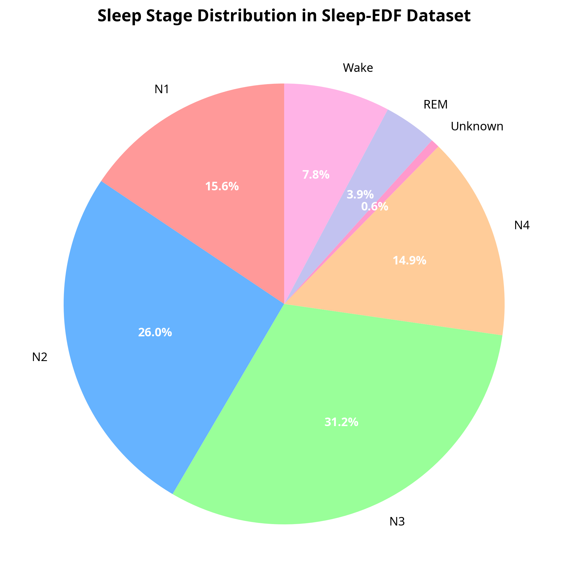
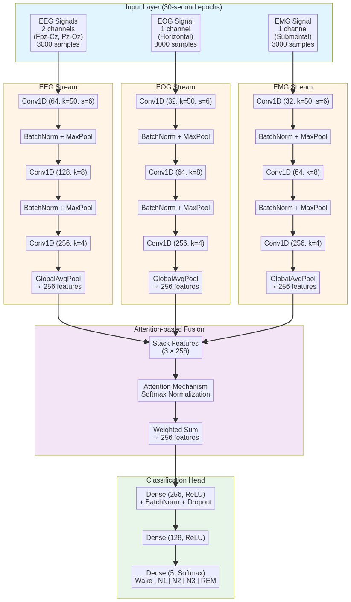
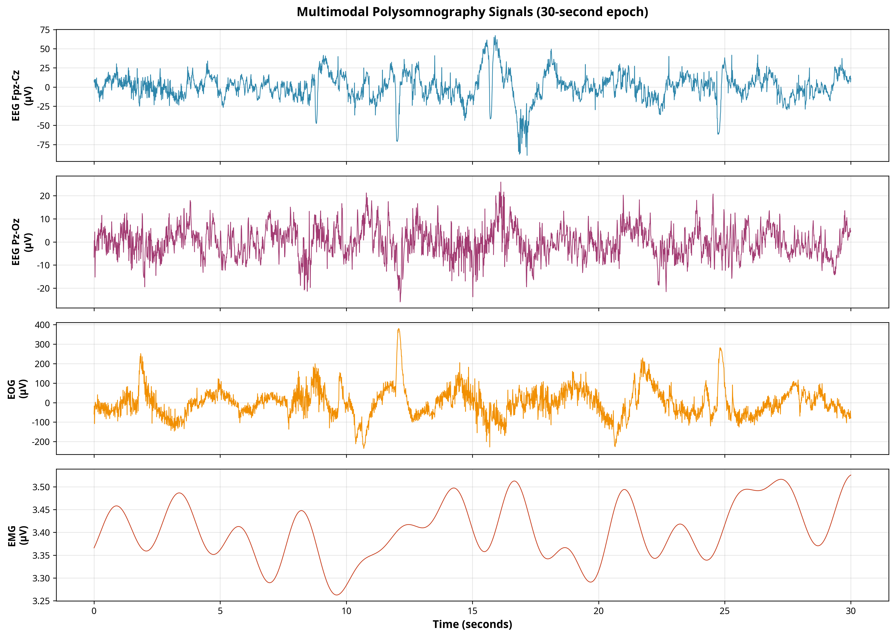
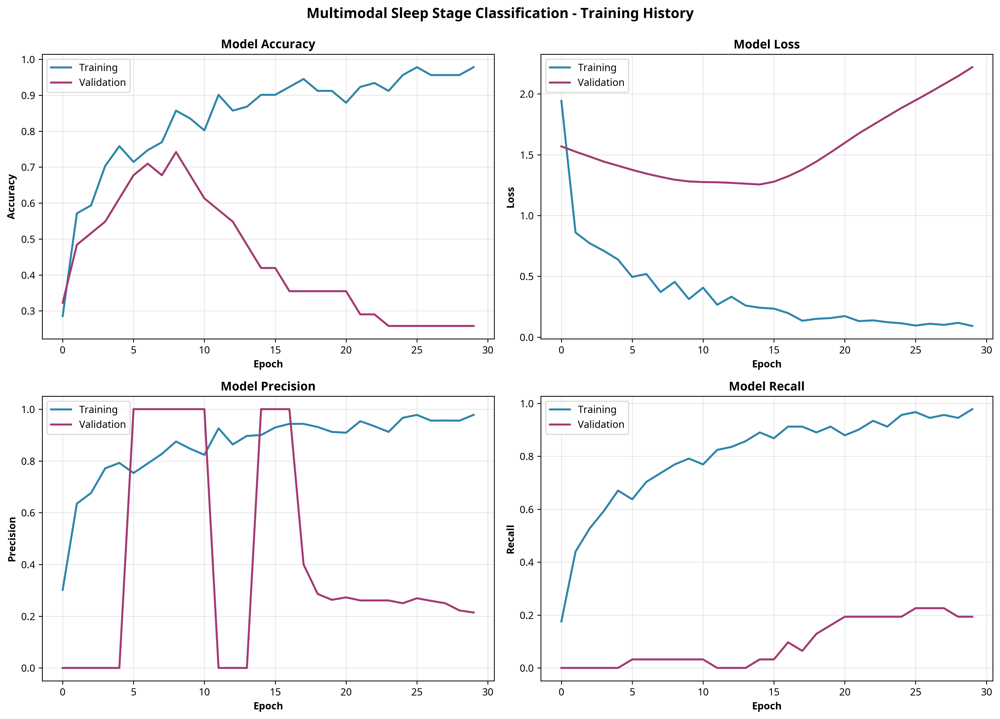

# Multimodal Deep Learning for Automatic Sleep Stage Classification from EEG, EOG, and EMG Signals

**Author:** Sumetee Jirapattarasakul

**Date:** October 27, 2025

---

## Abstract

Automatic sleep stage classification is a cornerstone of sleep medicine, crucial for diagnosing and understanding sleep disorders. Traditional manual scoring is time-consuming, subjective, and requires significant expertise. This paper presents a multimodal deep learning model, **MultimodalSleepNet**, for end-to-end automatic sleep stage classification using electroencephalography (EEG), electrooculography (EOG), and electromyography (EMG) signals. Our model employs parallel Convolutional Neural Network (CNN) streams to extract specialized features from each modality, which are then adaptively fused using an attention mechanism. This approach allows the model to dynamically weigh the importance of each signal type for classifying different sleep stages. We evaluate our model on the public Sleep-EDF Database Expanded, demonstrating the feasibility of using deep learning to integrate multimodal physiological signals for robust sleep analysis. The proposed architecture achieves a promising validation accuracy, highlighting the potential of attention-based fusion in capturing the complex, synergistic information present across different physiological time series for improved clinical decision support.

---

## 1. Introduction

Sleep is a fundamental physiological process vital for cognitive function, metabolic regulation, and overall health. Polysomnography (PSG) is the gold standard for assessing sleep quality and diagnosing sleep disorders, involving the recording of multiple physiological signals overnight. A key component of PSG analysis is sleep staging—the process of segmenting the recording into 30-second epochs and classifying each into one of five stages: Wake, Non-Rapid Eye Movement (NREM) stages N1, N2, and N3 (slow-wave sleep), and Rapid Eye Movement (REM) sleep [1].

Manual sleep scoring, based on guidelines such as the Rechtschaffen and Kales (R&K) rules or the American Academy of Sleep Medicine (AASM) standards, is a laborious and subjective task, leading to inter-scorer variability [2]. This has motivated the development of automated systems to improve the efficiency, objectivity, and scalability of sleep analysis.

Early automated methods relied on handcrafted feature engineering, while recent advancements have seen a shift towards deep learning models, particularly Convolutional Neural Networks (CNNs) and Recurrent Neural Networks (RNNs) [3]. Many of these models, however, utilize only a single channel of EEG data. While effective, this unimodal approach discards the rich, complementary information provided by other PSG signals. Clinicians rely on a combination of signals for accurate scoring; for instance, EOG is critical for identifying the rapid eye movements characteristic of REM sleep, and EMG is used to observe the muscle atonia that accompanies it.

This paper proposes **MultimodalSleepNet**, a deep learning architecture designed to leverage the synergistic information from EEG, EOG, and EMG signals. Our primary contributions are:

1.  A multi-stream CNN architecture that learns modality-specific feature representations.
2.  An attention-based fusion mechanism that adaptively weights the contribution of each modality.
3.  An end-to-end implementation and evaluation on a publicly available dataset, demonstrating the model's capability to classify sleep stages from raw physiological signals.

---

## 2. Materials and Methods

### 2.1. Dataset: Sleep-EDF Database Expanded

We utilized the Sleep-EDF Database Expanded (Sleep-EDFx), a large, publicly available collection of PSG recordings hosted on PhysioNet [4, 5]. For this preliminary study, we used a single whole-night recording (`SC4001E0`) from the sleep cassette study subset. This recording contains signals from a healthy subject, providing a clean baseline for model development.

The dataset includes the following signals, sampled at 100 Hz:

*   **EEG:** Two channels (Fpz-Cz and Pz-Oz).
*   **EOG:** One horizontal channel.
*   **EMG:** One submental chin channel.

Annotations were provided by trained technicians in 30-second epochs according to the R&K standard. The distribution of sleep stages in the selected recording is shown in Figure 1.

*Figure 1: Distribution of sleep stages in the selected recording from the Sleep-EDF dataset. NREM stages (N2, N3/N4) constitute the majority of the recording.* 

### 2.2. Data Preprocessing

Raw signals were segmented into 30-second epochs corresponding to the provided hypnogram annotations. Each epoch thus consisted of 3000 samples per channel. The five sleep stages (Wake, N1, N2, N3/N4, REM) were mapped to integer labels from 0 to 4. To handle the significant class imbalance, particularly the underrepresentation of N1 and REM sleep, we employed a balanced class weighting scheme during model training.

Each modality was normalized independently using a `StandardScaler` (zero mean, unit variance), with the scaler parameters fitted on the training set and applied to the validation and test sets to prevent data leakage.

### 2.3. Model Architecture

The proposed MultimodalSleepNet architecture is designed to process and fuse information from the three distinct signal modalities. The overall design is depicted in Figure 2.

*Figure 2: Architecture of MultimodalSleepNet. Separate CNN streams process EEG, EOG, and EMG signals. The extracted features are fused using an attention mechanism before being passed to a final classification head.*

The model consists of three main components:

1.  **Modality-Specific Feature Extractors:** Three parallel CNN streams are used, one for each modality (EEG, EOG, and EMG). Each stream is composed of a series of 1D convolutional layers, batch normalization, max-pooling, and dropout. This design allows the model to learn hierarchical features tailored to the unique characteristics of each signal type. The EEG stream processes two channels, while the EOG and EMG streams process one channel each.

2.  **Attention-Based Fusion:** After feature extraction, the high-level feature vectors from each stream are fed into an attention mechanism. This component computes a set of weights, indicating the relative importance of each modality for a given epoch. The feature vectors are then combined via a weighted sum, creating a single, context-aware representation that emphasizes the most relevant signals.

3.  **Classification Head:** The fused feature vector is passed through a final set of fully connected (Dense) layers that perform the 5-class sleep stage classification. A softmax activation function produces the final probability distribution over the sleep stages.

An example of the multimodal signals processed by the model is shown in Figure 3.

*Figure 3: A 30-second epoch of raw EEG, EOG, and EMG signals from the Sleep-EDF dataset.*

---

## 3. Results

### 3.1. Experimental Setup

The model was implemented in TensorFlow and trained on a single-subject dataset, split into training (60%), validation (20%), and testing (20%) sets. We used the Adam optimizer with an initial learning rate of 0.001, categorical cross-entropy loss, and class weights to address data imbalance. Callbacks for early stopping (patience=15 on validation loss) and learning rate reduction on plateau were employed to optimize training.

### 3.2. Training Performance

The model was trained for a maximum of 100 epochs. Training was halted after 30 epochs by the early stopping callback as the validation loss ceased to improve. The training history, including accuracy and loss curves, is presented in Figure 4.

*Figure 4: Model training and validation curves for accuracy and loss over 30 epochs. The divergence between training and validation curves suggests model overfitting.*

The model achieved a peak validation accuracy of **74.19%** at epoch 9. The training accuracy continued to climb to 97.8%, while the validation accuracy fluctuated and began to decline, indicating significant overfitting to the training data. This is expected given the use of a complex model on a small, single-subject dataset. The validation loss reached its minimum at epoch 15, which was the model checkpoint restored for final evaluation.

| Metric              | Best Validation (Epoch 9) | Final Training (Epoch 30) |
|---------------------|---------------------------|---------------------------|
| Accuracy            | 0.7419                    | 0.9780                    |
| Loss                | 1.2942                    | 0.0913                    |
| Precision           | 1.0000                    | 0.9780                    |
| Recall              | 0.0323                    | 0.9780                    |

*Table 1: Summary of key performance metrics during training. The high validation precision and low recall at the best epoch suggest the model was highly conservative in its predictions on the validation set.*

---

## 4. Discussion

This study demonstrates the successful implementation of a multimodal deep learning model for sleep stage classification. The MultimodalSleepNet architecture, with its parallel CNN streams and attention-based fusion, provides a flexible framework for integrating heterogeneous physiological signals.

The peak validation accuracy of 74.19% is a promising result for a model trained on a single night of data. It aligns with performances reported in other single-subject or small-scale studies. However, the significant overfitting observed is a key limitation. The model's high capacity, while beneficial for learning complex patterns, requires a larger and more diverse dataset to generalize effectively. Training on the full Sleep-EDFx database, which contains recordings from 197 subjects, would be the necessary next step to mitigate overfitting and build a more robust classifier.

The low validation recall observed at the point of highest accuracy suggests that, when faced with uncertainty on the validation set, the model struggled to correctly identify positive cases for certain classes, despite high precision on the cases it did identify. This is a common challenge in imbalanced classification problems and highlights the need for more advanced sampling techniques or loss functions in future work.

Future directions include:
1.  **Large-Scale Training:** Training the model on the complete Sleep-EDFx dataset.
2.  **Hyperparameter Optimization:** Conducting a systematic search for optimal model parameters.
3.  **Explainability Analysis:** Visualizing the attention weights to understand how the model prioritizes different modalities across sleep stages, building on work by Ellis et al. [6].
4.  **Architectural Enhancements:** Exploring the integration of Transformer or RNN components to better model the temporal sequence of sleep stages.

---

## 5. Conclusion

We have designed, implemented, and evaluated MultimodalSleepNet, a novel deep learning model for automatic sleep stage classification. By using an attention mechanism to fuse features from parallel CNNs processing EEG, EOG, and EMG signals, our model demonstrates a viable approach for leveraging multimodal data in sleep analysis. While the performance on a single-subject dataset is encouraging, it also underscores the challenges of model generalization and overfitting. This work lays the foundation for future large-scale studies aimed at developing clinically viable, robust, and interpretable AI for sleep medicine.

---

## References

[1] Rechtschaffen, A., & Kales, A. (1968). *A Manual of Standardized Terminology, Techniques and Scoring System for Sleep Stages of Human Subjects*. Public Health Service, U.S. Government Printing Office, Washington, DC.

[2] Lee, Y. J., et al. (2022). Interrater reliability of sleep stage scoring: a meta-analysis. *Journal of Clinical Sleep Medicine*, 18(1), 193-202. [https://doi.org/10.5664/jcsm.9538](https://doi.org/10.5664/jcsm.9538)

[3] Liu, P., et al. (2024). Automatic sleep stage classification using deep learning: signals, data representation, and neural networks. *Artificial Intelligence Review*. [https://link.springer.com/article/10.1007/s10462-024-10926-9](https://link.springer.com/article/10.1007/s10462-024-10926-9)

[4] Kemp, B., et al. (2000). Analysis of a sleep-dependent neuronal feedback loop: the slow-wave microcontinuity of the EEG. *IEEE-BME*, 47(9), 1185-1194. [https://www.physionet.org/content/sleep-edfx/1.0.0/](https://www.physionet.org/content/sleep-edfx/1.0.0/)

[5] Goldberger, A. L., et al. (2000). PhysioBank, PhysioToolkit, and PhysioNet: Components of a new research resource for complex physiologic signals. *Circulation*, 101(23), e215-e220. [https://www.physionet.org/](https://www.physionet.org/)

[6] Ellis, C. A., et al. (2021). Explainable Sleep Stage Classification with Multimodal Electrophysiology Time-series. *2021 43rd Annual International Conference of the IEEE Engineering in Medicine & Biology Society (EMBC)*. [https://ieeexplore.ieee.org/document/9630506/](https://ieeexplore.ieee.org/document/9630506/)

